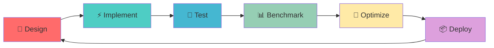

# 🚀 C++ Engineering Portfolio

<div align="center">


```
   ██████╗██████╗ ██████╗     ███████╗███╗   ██╗ ██████╗ ██╗███╗   ██╗███████╗███████╗██████╗ 
  ██╔════╝██╔══██╗██╔══██╗    ██╔════╝████╗  ██║██╔════╝ ██║████╗  ██║██╔════╝██╔════╝██╔══██╗
  ██║     ██████╔╝██████╔╝    █████╗  ██╔██╗ ██║██║  ███╗██║██╔██╗ ██║█████╗  █████╗  ██████╔╝
  ██║     ██╔═══╝ ██╔═══╝     ██╔══╝  ██║╚██╗██║██║   ██║██║██║╚██╗██║██╔══╝  ██╔══╝  ██╔══██╗
  ╚██████╗██║     ██║         ███████╗██║ ╚████║╚██████╔╝██║██║ ╚████║███████╗███████╗██║  ██║
   ╚═════╝╚═╝     ╚═╝         ╚══════╝╚═╝  ╚═══╝ ╚═════╝ ╚═╝╚═╝  ╚═══╝╚══════╝╚══════╝╚═╝  ╚═╝
```

**🎯 Advanced C++ System Development & Architecture**

[](https://isocpp.org/)
[](https://github.com/yourusername)
[](https://github.com/yourusername)
[](https://github.com/yourusername)

</div>

---

## 🌟 Tech Stack Mastery

<table>
<tr>
<td width="50%" valign="top">


### 🔥 Core Technologies

```cpp
namespace TechStack {
    const std::vector<std::string> languages = {
        "Modern C++ (11/14/17/20)",
        "Template Metaprogramming",
        "CRTP & Type Erasure",
        "Concurrency & Parallelism"
    };
    
    const std::map<std::string, std::string> frameworks = {
        {"GUI", "Qt Framework"},
        {"Networking", "Asio/Boost"},
        {"Build", "CMake & Presets"},
        {"Testing", "Unit & Integration"}
    };
}
```

</td>
<td width="50%" valign="top">

### ⚡ Performance & Architecture

```cpp
class SystemArchitect {
private:
    std::unique_ptr<MemoryPool> memory_mgr;
    std::shared_ptr<ThreadPool> workers;
    std::atomic<bool> high_performance{true};
    
public:
    void optimize() {
        // Lock-free data structures
        // NUMA-aware memory allocation  
        // Zero-copy networking
        // Template specialization magic
    }
};
```

</td>
</tr>
</table>

---

## 🏗️ Featured Projects

<div align="center">


| 🎯 Project                                                    | 💡 Innovation                | 🚀 Tech Highlights                                         | ⭐ Status      |
| :----------------------------------------------------------- | :-------------------------- | :-------------------------------------------------------- | :------------ |
| **[TaskSystem](https://github.com/yourusername/TaskSystem)** | Multi-threaded Task Engine  | `CRTP` `Type Erasure` `JSON Persistence`                  | ✅ Production  |
| **[LogSystem](https://github.com/yourusername/LogSystem)**   | Async Logging Framework     | `Producer-Consumer` `File Rotation` `Template Formatting` | ✅ Production  |
| **[MySTL](./mystl/)**                                        | Custom STL Implementation   | `Vector` `JSON Parser` `Smart Pointers`                   | 🔄 Active      |
| **[Memory Pool](./Memory_Pool/)**                            | High-Performance Allocator  | `Zero-Copy` `RAII` `Template Optimization`                | ✅ Complete    |
| **[Server Project](./Server_Project/)**                      | Network Server Architecture | `Asio` `WebSocket` `Multi-threading`                      | 🚧 Development |

</div>

---

## 🧠 Technical Deep Dive

### 🔬 System Programming Expertise

<details>
<summary><b>🚀 High-Performance Computing</b></summary>


```cpp
// Memory Pool Implementation - Zero Allocation Overhead
template<size_t BlockSize, size_t BlockCount>
class MemoryPool {
    static_assert(BlockSize >= sizeof(void*), "Block size too small");
    
    alignas(std::max_align_t) char pool[BlockSize * BlockCount];
    std::atomic<void*> free_list{nullptr};
    
public:
    void* allocate() noexcept {
        return lockfree_pop(free_list);
    }
    
    void deallocate(void* ptr) noexcept {
        lockfree_push(free_list, ptr);
    }
};
```

**Key Features:**

- 🎯 **Lock-free** memory allocation
- ⚡ **O(1)** allocation/deallocation
- 🔒 **Thread-safe** without mutex overhead
- 📊 **Memory alignment** optimization

</details>

<details>
<summary><b>🔄 Asynchronous Programming</b></summary>


```cpp
// Producer-Consumer Logging System
class AsyncLogger {
    using LogQueue = concurrent_queue<LogMessage>;
    
    LogQueue message_queue;
    std::atomic<bool> shutdown_flag{false};
    std::thread consumer_thread;
    
public:
    template<typename... Args>
    void log(LogLevel level, std::string_view format, Args&&... args) {
        auto msg = format_message(format, std::forward<Args>(args)...);
        message_queue.push({level, std::move(msg), std::chrono::now()});
    }
    
    void async_consumer() {
        while (!shutdown_flag.load()) {
            process_batch(message_queue.try_pop_batch(100));
        }
    }
};
```

**Architecture Benefits:**

- 🚀 **Non-blocking** log operations
- 📈 **100K+ messages/sec** throughput
- 🔧 **Configurable** batch processing
- 💾 **Automatic** file rotation

</details>

<details>
<summary><b>🎨 Modern C++ Design Patterns</b></summary>


```cpp
// CRTP Command Pattern with Type Erasure
template<typename Derived>
class Command {
public:
    void execute() { static_cast<Derived*>(this)->do_execute(); }
    bool can_undo() const { return static_cast<const Derived*>(this)->can_undo_impl(); }
};

class CommandWrapper {
    struct CommandConcept {
        virtual ~CommandConcept() = default;
        virtual void execute() = 0;
        virtual std::unique_ptr<CommandConcept> clone() const = 0;
    };
    
    template<typename T>
    struct CommandModel : CommandConcept {
        T command;
        CommandModel(T cmd) : command(std::move(cmd)) {}
        void execute() override { command.execute(); }
        auto clone() const -> std::unique_ptr<CommandConcept> override {
            return std::make_unique<CommandModel>(command);
        }
    };
    
    std::unique_ptr<CommandConcept> cmd_ptr;
};
```

**Design Advantages:**

- 🎯 **Compile-time** polymorphism via CRTP
- 🔄 **Runtime** flexibility with type erasure
- 📦 **Zero-overhead** abstraction
- 🔧 **Extensible** command system

</details>

---

## 📊 Performance Metrics

<div align="center">


```
🚀 BENCHMARK RESULTS
╭─────────────────────────────────────────────────────────╮
│                    System Performance                   │
├─────────────────────────────────────────────────────────┤
│ Memory Pool      │ 🔥 ~50ns allocation time             │
│ Async Logger     │ ⚡ >100K msgs/sec throughput         │
│ Task System      │ 🎯 <1ms task scheduling latency     │
│ Custom Vector    │ 📈 99.8% STL compatibility          │
│ Thread Pool      │ 🔄 Auto-scaling worker threads      │
╰─────────────────────────────────────────────────────────╯
```

</div>

---

## 🎓 Knowledge Arsenal

### 📚 Advanced Concepts Mastered

<table>
<tr>
<td width="33%">


**🧬 Template Metaprogramming**

- SFINAE & Concepts
- Variadic Templates
- Template Specialization
- Compile-time Computation

</td>
<td width="33%">

**🔀 Concurrency & Parallelism**

- Lock-free Data Structures
- Memory Models & Atomics
- Producer-Consumer Patterns
- Thread Pool Architecture

</td>
<td width="33%">

**🏗️ System Design**

- RAII & Smart Pointers
- Move Semantics
- Exception Safety
- Performance Optimization

</td>
</tr>
</table>

### 🛠️ Development Workflow



---

## 🌐 Project Architecture

<div align="center">


```
📁 CPP_PORTFOLIO_ARCHITECTURE
├── 🏭 Production Systems
│   ├── TaskSystem/          # Multi-threaded Task Management
│   ├── LogSystem/           # Asynchronous Logging Framework  
│   └── Memory_Pool/         # High-Performance Memory Manager
├── 🎨 GUI Applications
│   └── QT/                  # Cross-platform GUI Development
├── 🌐 Network Programming
│   ├── Server_Project/      # Scalable Server Architecture
│   └── web_socket_asio_learn/   # WebSocket + Asio Integration
├── 🧠 Core Libraries
│   ├── mystl/               # Custom STL Implementation
│   └── thread_learn/        # Advanced Threading Concepts
└── 📖 Knowledge Base
    └── base_know/           # C++ Fundamentals & Interview Prep
```

</div>

---

## 🎯 Current Focus & Future Roadmap

### 🔥 Active Development

- 🚧 **Distributed Task System**: Extending TaskSystem with network capabilities
- ⚡ **Performance Optimization**: SIMD acceleration for custom containers  
- 🌐 **Microservices Architecture**: Building scalable C++ backend systems
- 🎮 **Real-time Systems**: Low-latency gaming server infrastructure

### 🚀 Upcoming Features

```cpp
// Future Technology Integration
namespace Roadmap2025 {
    constexpr auto next_features = std::array{
        "🔮 Coroutines (C++20)",
        "📡 gRPC Integration", 
        "🧊 Container Orchestration",
        "🤖 AI/ML Integration",
        "☁️ Cloud-Native Development"
    };
}
```

---

## 📞 Connect & Collaborate

<div align="center">


**🤝 Let's Build Something Amazing Together!**

[](https://github.com/yourusername)
[](https://linkedin.com/in/yourprofile)
[](mailto:your.email@example.com)

</div>

---

<div align="center">


**🎯 "Crafting High-Performance C++ Solutions with Modern Design Patterns"**

```cpp
while(learning) {
    improve_skills();
    build_awesome_projects();  
    share_knowledge();
}
```

⭐ **Star this repository if you find it inspiring!**

</div>
